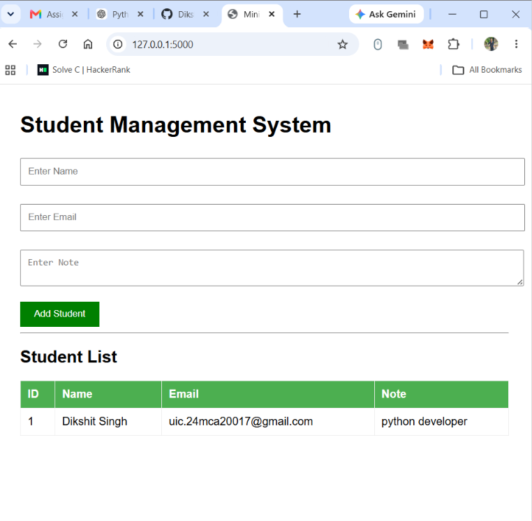
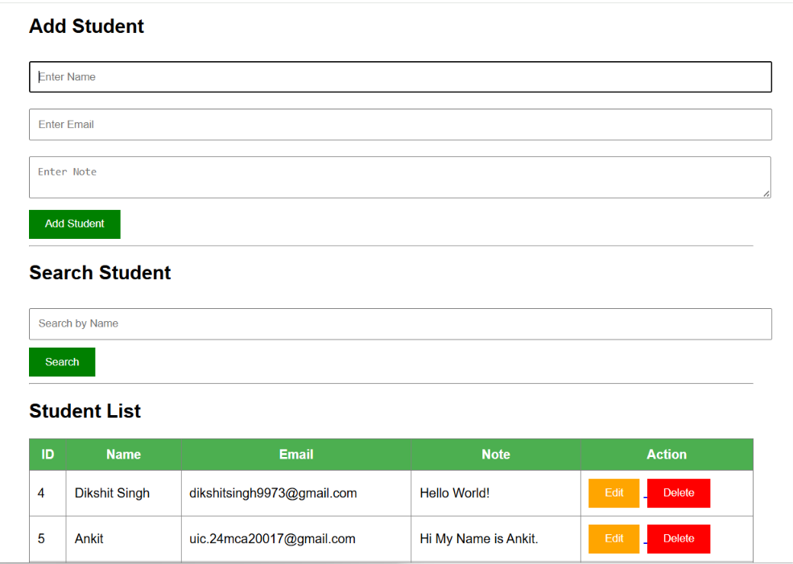
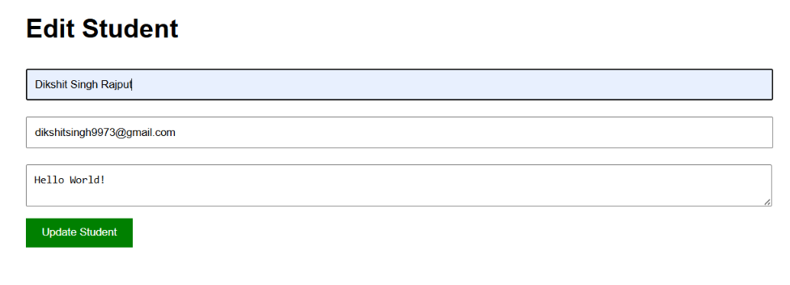
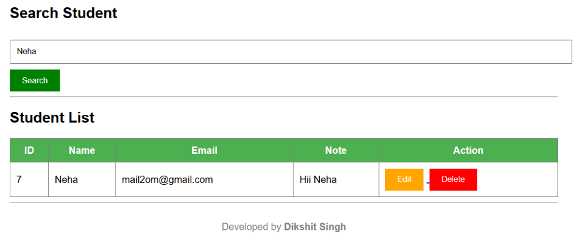

# MiniCRUDApp

# 🎓 Student Management System

> A simple and responsive **Student Management System** built using **Python, Flask, and SQLite**. This project demonstrates complete **CRUD (Create, Read, Update, Delete)** operations with a clean web interface and SQLite database integration.

> 🚀 Developed as part of the **NestorBird Engineering Intern Assignment 2026**.

---

# 📌 Project Overview

The Student Management System allows users to efficiently manage student records through an easy-to-use web interface.

### Users can:

* ➕ Add Student Records
* 📋 View All Students
* ✏️ Edit Student Information
* 🗑️ Delete Student Records
* 🔍 Search Students by Name
* 💾 Store Data Using SQLite Database

---

# 🚀 Features

* ✅ Create Student
* ✅ Read Student Records
* ✅ Update Student Details
* ✅ Delete Student Records
* ✅ Search Student by Name
* ✅ SQLite Database Integration
* ✅ Responsive User Interface
* ✅ Clean Project Structure

---

# 🛠️ Technology Stack

* Python 3.13
* Flask 3.1.2
* SQLite
* HTML5
* CSS3

---

# 📂 Project Structure

```text
MiniCRUDApp/
│
├── app.py
├── database.db
├── requirements.txt
├── README.md
│
├── static/
│   └── style.css
│
└── templates/
    ├── index.html
    └── edit.html
```

---

# ⚙️ Installation

### 1️⃣ Clone Repository

```bash
git clone https://github.com/your-github-username/MiniCRUDApp.git
```

### 2️⃣ Open Project Folder

```bash
cd MiniCRUDApp
```

### 3️⃣ Install Dependencies

```bash
pip install -r requirements.txt
```

### 4️⃣ Run Application

```bash
python app.py
```

---

# 🌐 Run the Project

Open your browser and visit:

```text
http://127.0.0.1:5000
```

---

# 💾 Database

Database Used:

**SQLite**

Database File:

```text
database.db
```

Database Table:

```text
students
```

| Column | Type    |
| ------ | ------- |
| id     | INTEGER |
| name   | TEXT    |
| email  | TEXT    |
| note   | TEXT    |

---

# 📸 Project Screenshots

## 🏠 Home Page

> *(Add your homepage screenshot here)*

```markdown

```

---

## ➕ Add Student

> *(Add Add Student page screenshot here)*

```markdown

```

---

## ✏️ Edit Student

> *(Add Edit Student page screenshot here)*

```markdown

```

---

## 🔍 Search Student

> *(Add Search page screenshot here)*

```markdown

```

---

# 🎥 Project Demo Video

You can watch the complete project demonstration here:

🔗 **Demo Video:**

```text
https://your-demo-video-link-here.com
```

> Replace the above link with your YouTube, Loom, Google Drive, or any other video link after uploading your demo.

---

# 📚 Learning Outcomes

During this project, I learned:

* Flask Routing
* CRUD Operations
* SQLite Database Integration
* HTML Forms
* CSS Styling
* Jinja2 Templates
* Search Functionality
* Backend Development with Flask
* Database Operations using SQLite

---

# 🚀 Future Enhancements

* User Authentication
* Bootstrap UI
* Email Validation
* Export Student Data to CSV
* Dashboard Analytics
* REST API Integration
* Pagination

---

# 👨‍💻 Developed By

## **Dikshit Singh**

**MCA Student (2026)**
**Chandigarh University**

### Connect with Me

**GitHub:**
https://github.com/your-github-username

**LinkedIn:**
https://www.linkedin.com/in/dikshitsingh99/

---

# 📄 License

This project is created for educational purposes and submitted as part of the **NestorBird Engineering Intern Assignment 2026**.

---

⭐ **If you found this project useful, consider giving it a star on GitHub!**
